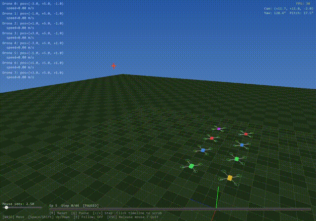

# Swarm Sim ML

Multi-agent reinforcement learning for cooperative drone swarm tactics. A swarm of 8 drones learns to approach and strike a static target from diverse angles using PPO with parameter sharing.

A pretrained model is included — run `python train.py eval --model-path checkpoints/ppo_swarm_final` to see it in action.



## Architecture

- **`drone.py`** — 3D point-mass drone (double-integrator dynamics, drag, speed/accel limits)
- **`env.py`** — PettingZoo `ParallelEnv`: 52D observations, 3D acceleration actions, 3D angular repulsion
- **`train.py`** — PPO training via stable-baselines3 + SuperSuit, with resume and eval support
- **`viewer.py`** — OpenGL FPV viewer with mouse look, WASD movement, drone trails, and HUD

## Setup

```
pip install -r requirements.txt
```

## Quick Start (pretrained model)

```
python train.py eval --model-path checkpoints/ppo_swarm_final
```

Opens the 3D viewer with trained drones. Mouse to look, WASD to move, ESC to quit.

## Train

```
python train.py train --total-timesteps 2000000
```

Resume from a checkpoint:

```
python train.py train --resume checkpoints/ppo_swarm_final --total-timesteps 1000000
```

See [commands.md](commands.md) for all options.

Monitor training:

```
tensorboard --logdir ./logs/
```

## Standalone Viewer

```
python viewer.py
```

Runs the viewer with random-walk drones (no trained model needed).

## How It Works

All 8 drones share a single MLP policy network (parameter sharing via SuperSuit). Each drone observes its own state, relative target vector (with azimuth/elevation angles), offset from swarm centroid, 5 nearest neighbors, and a one-hot drone ID.

**Reward signal:**
- **Approach** — reward for closing distance, scaled down when angular separation is small
- **Angular spread** — positive reward for maintaining unique approach angles (3D)
- **Angular repulsion** — penalty when too close in angle to another drone (< 45°)
- **Hit bonus** — large reward on target contact, with bonus for unique approach angle
- **Loiter penalty** — penalizes low closing speed near the target
- **Death penalties** — collisions (-20), ground crashes (-20), out-of-bounds (-20), timeout (-10)
